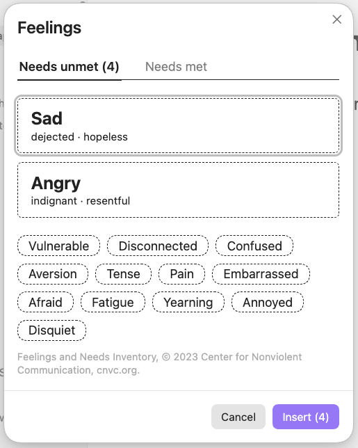
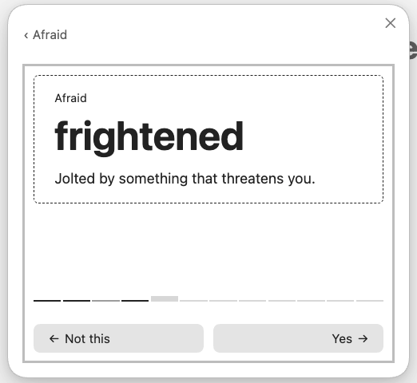
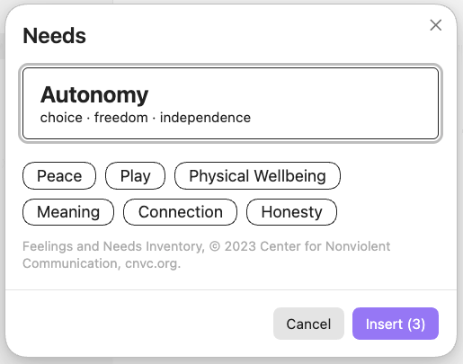

# Nonviolent Communication

Pick feelings and needs to put into an Obsidian note. It adds two commands:
**Insert feelings…** and **Insert needs…**



Open a category and mark every word in it at once — or ask to be walked through
it a word at a time, with a definition for each, which is how you find the words
you would never have picked off a list.





What lands at the cursor is ordinary markdown, so the note still reads with the
plugin turned off:

```md
- Angry: incensed, indignant, outraged
- Peaceful: calm, content
```

With it on, that block can be redrawn as a list, a table, or one
comma-separated line. **Edit…** reopens the picker on what it already holds,
and **Convert to Markdown** turns it into plain markdown for good.

## Install

From inside Obsidian: Settings → Community plugins → **Browse**, search for
**NVC** or **Nonviolent Communication**, then **Install** and **Enable**.

## Attribution

The feelings and needs word lists come from the Center for Nonviolent
Communication's Feelings and Needs Inventory, © 2023 Center for Nonviolent
Communication, [cnvc.org](https://www.cnvc.org). CNVC gives permission to copy
and share it and asks to be credited; the plugin carries that credit under the
categories in both pickers, and anything else built from this code inherits the
same obligation.

The definitions attached to each word are not from CNVC. They were written for
this project.

## License

[MIT](LICENSE), for this project's own code.

That covers the code only. The CNVC word lists keep their own terms, described
under Attribution above — the MIT license does not relicense them.

## Building it

See [CONTRIBUTING.md](CONTRIBUTING.md) for running the plugin from source, the
component gallery it is built from, and how releases are cut.
