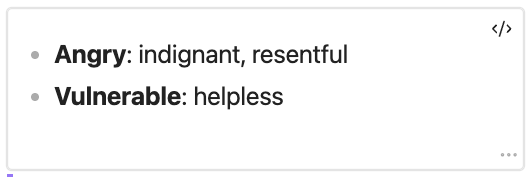

# Nonviolent Communication

An Obsidian plugin for putting feelings and needs into a note.

It adds two commands — **Insert feelings…** and **Insert needs…** — each
opening a picker over the note you are in. Feelings are split the way the
source splits them, by whether a need was met; a category you have answered
shows what you kept.


Open a category and every word in it is there to mark at once. Or ask to be
walked through it a word at a time, with a definition for each — which is how
you find the words you would never have picked off a list.


Needs work the same way, as one undivided list.


What you picked lands at the cursor:

```md
- Angry: incensed, indignant, outraged
- Peaceful: calm, content
```

The words come from the Center for Nonviolent Communication's Feelings and
Needs Inventory. What goes in the note is a fenced block whose body is those
same bullets, so the note still reads with the plugin turned off. With it on,
the block can be redrawn as a list, a table, or one comma-separated line,
**Edit…** reopens the picker on what it already holds, and **Convert to
Markdown** turns it into ordinary markdown for good.



## Install

From inside Obsidian: Settings → Community plugins → **Browse**, search for
**NVC** or **Nonviolent Communication**, then **Install** and **Enable**.

### Betas

To run what is on `main` ahead of a release, use
[BRAT](https://tfthacker.com/BRAT):

1. Install **BRAT** from Settings → Community plugins.
2. Open the command palette and run **BRAT: Add a beta plugin for testing**.
3. Paste `jmagaram/nvc-tools` and click **Add Plugin**.
4. Enable **Nonviolent Communication** under Settings → Community plugins.

BRAT checks for new releases on startup, so updates arrive on their own. Don't
run both copies at once — disable whichever you are not testing.

## Attribution

The feelings and needs word lists come from the Center for Nonviolent
Communication's Feelings and Needs Inventory, © 2023 Center for Nonviolent
Communication, [cnvc.org](https://www.cnvc.org). CNVC gives permission to copy
and share it and asks to be credited; the plugin carries that credit under the
categories in both pickers, and anything else built from this code inherits the
same obligation.

The definitions attached to each word are not from CNVC. They were written for
this project.

## License

[MIT](LICENSE), for this project's own code.

That covers the code only. The CNVC word lists keep their own terms, described
under Attribution above — the MIT license does not relicense them.

## Building it

See [CONTRIBUTING.md](CONTRIBUTING.md) for running the plugin from source, the
component gallery it is built from, and how releases are cut.
